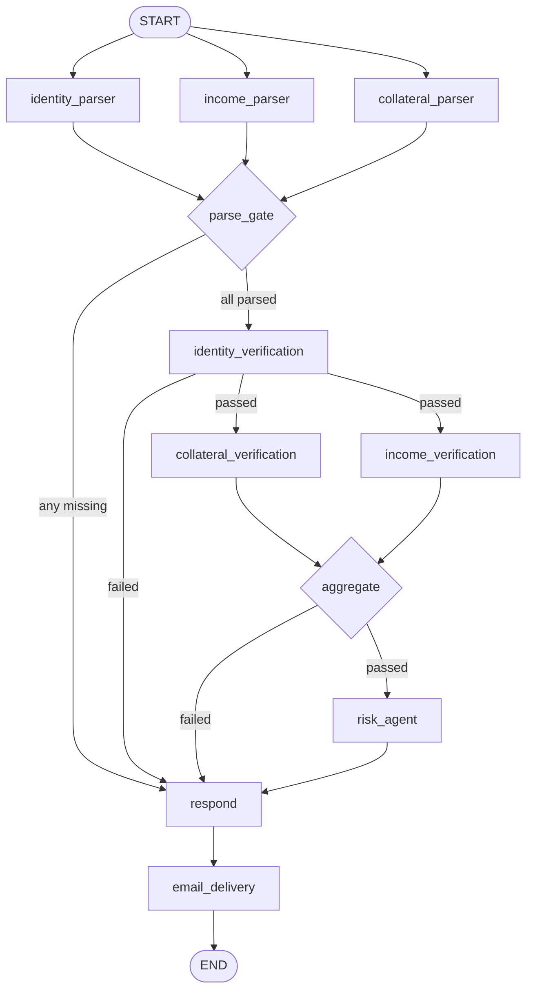

# 🏠 HomeLoanAgent

**An agentic home-loan underwriting system for the Indian market.** Applicants submit their KYC, income, and collateral documents through a web app; a multi-agent [LangGraph](https://langchain-ai.github.io/langgraph/) pipeline running on **AWS Bedrock (Amazon Nova Pro)** classifies and reads the documents, verifies each fact against external registries, computes the lending math (EMI / LTV / FOIR), reaches an **approve / conditional / decline** decision, and emails the applicant a PDF decision report. Borderline cases are **parked for a human underwriter**, who approves or declines them from an admin console — and the applicant's dashboard updates with the final verdict.

> **India scope:** built for the Indian home-loan market — amounts in **INR (₹)** with **lakh/crore** numbering (`en-IN`), **Aadhaar/PAN** KYC, salary/income proofs (**payslip, bank statement, Form-16/ITR**) and property proofs (**Registered Sale Deed / valuation report / Agreement to Sell + Encumbrance Certificate (EC)**), and checks aligned with **RBI** guidance, **CIBIL/bureau** practice, **PMLA-KYC** norms, and the **DPDP Act 2023**. All rates and thresholds below are configurable examples, not regulatory prescriptions.

> Looking for the implementation-level story — the exact mechanisms, data shapes, and the *why* behind every design choice? See **[docs/PROJECT_DEEP_DIVE.md](docs/PROJECT_DEEP_DIVE.md)**.

---

## Table of contents

- [What it does](#what-it-does)
- [Architecture](#architecture)
- [The agentic pipeline](#the-agentic-pipeline)
- [Decision logic](#decision-logic)
- [Human-in-the-loop review](#human-in-the-loop-review)
- [Tech stack](#tech-stack)
- [Repository layout](#repository-layout)
- [Prerequisites](#prerequisites)
- [Setup & installation](#setup--installation)
- [Configuration](#configuration)
- [Running the system](#running-the-system)
- [HTTP API reference](#http-api-reference)
- [Data model](#data-model)
- [Mock verification APIs](#mock-verification-apis)
- [Security notes](#security-notes)
- [Known limitations & assumptions](#known-limitations--assumptions)
- [Glossary](#glossary)
- [Roadmap](#roadmap)

---

## What it does

| Capability | Detail |
| --- | --- |
| **Document intake** | Upload identity (Aadhaar — 12 digits / PAN — `ABCDE1234F` format), income (salary slip / bank statement / Form-16 / ITR), and collateral (Registered Sale Deed / valuation report / Agreement to Sell + Encumbrance Certificate (EC)) documents. |
| **Type gating** | Every upload is classified by an LLM at intake — an unexpected document type (e.g. a payslip in the identity slot) is rejected before it is ever stored. |
| **Structured extraction** | Bedrock reads each document and extracts typed fields (ID number, DOB, monthly income, property value, …). |
| **Fact verification** | Extracted facts are cross-checked against mock government/employer/property registries via tool-calling agents (Aadhaar/PAN/DOB; income, employer & existing EMIs; property title & valuation). |
| **Lending math** | Deterministic EMI (in ₹), sanctioned amount (LTV-capped; amounts shown in lakh/crore), and FOIR are computed in code — the LLM never invents a figure. |
| **Risk decision** | An LLM makes the call within hard FOIR guardrails: **approved**, **conditional** (parked for human review), or **declined**. |
| **Human-in-the-loop** | **Conditional** applications wait for an underwriter, who **approves or declines** them from the admin console; the verdict flows back to the applicant. |
| **Communications** | Generates and emails a PDF decision report to the applicant (AWS SES); for conditional cases, also emails a human reviewer a packet with presigned document links. Timestamps in IST (Asia/Kolkata); phone numbers in +91 format with PIN-code addresses. |
| **Web app** | JWT-authenticated React SPA with an applicant dashboard (apply, track status) and an admin console (all applications, metrics, manual approve/decline). |

---

## Architecture

The project is three cooperating parts plus a persistence layer.

```
                         ┌─────────────────────────────────────────────┐
                         │            frontend/ (React 19 SPA)          │
                         │  Apply · User dashboard · Admin console      │
                         └───────────────────┬─────────────────────────┘
                                             │  REST + JWT (Bearer)
                                             ▼
                         ┌─────────────────────────────────────────────┐
                         │          backend/ (FastAPI, server.py)       │
                         │  auth · /upload · /submit · /status ·        │
                         │  lists · admin manual decision               │
                         └───┬──────────────┬───────────────┬───────────┘
             users.db (auth) │       S3 (documents)         │ DynamoDB (applications)
                             │              │               │
                             ▼              ▼               ▼
                         ┌─────────────────────────────────────────────┐
                         │      agent_flow/ (LangGraph pipeline)        │
                         │  parse → verify → aggregate → risk →         │
                         │  respond → email delivery                    │
                         └───────────────────┬─────────────────────────┘
                                             │
                    ┌────────────────────────┼──────────────────────────┐
                    ▼                        ▼                           ▼
           AWS Bedrock (Nova Pro)   Mock registries (HTTP)        AWS SES (email)
           classify / extract /     Aadhaar·PAN·DOB · income ·    applicant PDF +
           verify / decide          existing EMIs · collateral    reviewer packet
```

- **`agent_flow/`** — the "brain". A stateless, compiled LangGraph that takes an application's form + document references and returns a decision payload. Storage and mail are injected as adapters, so the identical graph runs on S3/SES in production or on local files in dev (see [`agent_flow/main.py`](agent_flow/main.py)).
- **`backend/`** — a FastAPI app that handles auth, document upload/classification, kicks off the graph **asynchronously** (FastAPI `BackgroundTasks`), persists results, and lets an admin resolve applications parked for manual review.
- **`frontend/`** — a React + TypeScript SPA (see its own [README](frontend/README.md)).
- **`legacy-frontend/`** — the original static HTML/JS prototype, kept for reference (superseded by `frontend/`).

> **AWS region:** deploy the data plane (S3, DynamoDB, SES) in **`ap-south-1` (Mumbai)** for data residency and low latency for Indian PII. Run Bedrock inference in the closest region that supports the required model (e.g. Amazon Nova Pro); if Nova Pro is unavailable in `ap-south-1`, keep applicant data in `ap-south-1` and call Bedrock in the nearest supported region.

---

## The agentic pipeline

Defined in [`agent_flow/graph/workflow.py`](agent_flow/graph/workflow.py). Nodes fan out and back in; **every path funnels through the `respond` node and then `email_delivery`**, so there is always exactly one well-formed response and one delivery attempt.



### Stage by stage

1. **Parsers** (`identity_parser`, `income_parser`, `collateral_parser`) run in parallel. Each loads the document bytes from storage (sniffing the real MIME type, not trusting the declared one) and uses Bedrock to extract typed fields. A read/parse failure for a slot is recorded and short-circuits the run.
2. **`parse_gate`** is a fan-in barrier: it only proceeds if **all three** documents parsed; otherwise it routes to `respond`.
3. **`identity_verification`** ([`identity_agent.py`](agent_flow/agents/doc_verification/identity_agent.py)) — Bedrock **forced tool use**. The model must call the `aadhar_verification` / `pan_verification` / `dob_verification` tools (which hit the mock identity registry), then emit a typed `{verified, reason}` verdict. Identity is a hard gate: a failure short-circuits straight to a decline.
4. **`income_verification`** and **`collateral_verification`** run in parallel once identity passes. Income checks the extracted facts against the income registry and returns a typed verdict that includes the verified **monthly income** *and the applicant's existing monthly EMI* (from the registry's `existing_obligations`). Collateral returns the verified property **value** plus property flags (flood zone, title clear, encumbrances, occupancy, etc.).
5. **`aggregate`** ([`aggregate_agent.py`](agent_flow/agents/doc_verification/aggregate_agent.py)) — fan-in. **Deterministic** math (no LLM): computes the sanctioned amount (capped at max LTV of the verified property value), the EMI, and echoes the rate/tenure. Fails closed if income or collateral did not pass.
6. **`risk_agent`** ([`risk_agent.py`](agent_flow/agents/doc_verification/risk_agent.py)) — computes **FOIR** deterministically from income, the proposed EMI, and the applicant's existing EMIs, then lets the LLM decide within hard guardrails (see [Decision logic](#decision-logic)). Fails closed to `incomplete` on any missing input.
7. **`respond`** ([`respond_agent.py`](agent_flow/agents/respond_agent.py)) — the universal terminal node. Reads the full state, assembles the fixed-schema `frontend_response` (decision, passed/failed checks, message, next steps, EMI/amounts). Uses the LLM only to phrase the applicant-facing message, always with a deterministic fallback so it can never crash.
8. **`email_delivery`** ([`email_delivery.py`](agent_flow/agents/email_delivery.py)) — runs for **every** decision. Builds a PDF decision report and emails the applicant (SES). Applicant-facing content is generated in an isolated LLM call that never sees internal risk metrics (FOIR, scores). For **conditional** cases it additionally emails a human reviewer a packet with presigned document links.

> **Note:** the standalone `classify` node is commented out inside the graph — document-type classification currently happens at **upload time** in the backend ([`server.py`](backend/server.py) `/api/upload`), so a wrong-type document is rejected before it is stored.

---

## Decision logic

All thresholds live as named constants next to the code that enforces them.

**Lending math** — [`aggregate_agent.py`](agent_flow/agents/doc_verification/aggregate_agent.py):

| Constant | Value | Context (India) |
| --- | --- | --- |
| `ANNUAL_INTEREST_RATE` | `8.5%` | Example rate only; Indian home-loan rates vary by lender, loan slab, and CIBIL score — configurable. |
| `MAX_LTV` | `0.80` | Simplified cap: bank finances at most 80% of the verified property value. RBI's slab-wise caps differ by loan size (e.g. smaller loans up to 90%, larger loans down to 75%) — configure per current RBI guidance. |
| Sanctioned amount | `min(requested, MAX_LTV × property_value)` | The principal actually offered (in ₹). |
| EMI | standard amortization formula | Monthly EMI in ₹, over the requested tenure. |

**Risk / FOIR bands** — [`risk_agent.py`](agent_flow/agents/doc_verification/risk_agent.py). **FOIR = (existing EMIs + proposed EMI) / net monthly income** (Fixed Obligation to Income Ratio, also called Family FOIR by Indian lenders), where the existing EMIs come from the income registry's `existing_obligations` (defaults to 0 if the registry reports none). In production the existing-EMI input would come from a CIBIL/bureau pull; the bands below are configurable guardrails, not RBI mandates:

| FOIR | Outcome |
| --- | --- |
| ≤ 45% (`FOIR_APPROVE_MAX`) | **approved** (auto-grant band) |
| 45% – 55% (`FOIR_CONDITIONAL_MAX`) | **conditional** (escalate to a human underwriter) |
| > 55% | **declined** |

The LLM proposes the decision; a deterministic guardrail then clamps it toward the safer outcome (approved → conditional → declined) so a rare model drift can never over-approve. The model may also *tighten* the call based on collateral flags (a flood-zone flag, an encumbrance, …).

**Eligibility checks** — [`identity_tools.py`](agent_flow/tools/identity_verification_tools/identity_tools.py): applicant must be **≥ 18**, and **age + loan term ≤ 60 years** (60 = typical Indian superannuation/retirement age; actual lender limits vary by employment type — configure per policy).

---

## Human-in-the-loop review

A **conditional** decision means *"the agent could not auto-decide; a human underwriter must."* Such applications surface as **"Under Review"** everywhere in the UI.

- The **admin console** ([`AdminDashboard.tsx`](frontend/src/pages/AdminDashboard.tsx)) shows an **Under review** metric tile and, in each under-review application's detail view, **Approve** / **Decline** buttons.
- Deciding calls `POST /api/admin/applications/{application_id}/decision` with `{ decision: "approved" | "declined", note? }`. The backend:
  - accepts the verdict **only** if the application is still `conditional` (a DynamoDB `ConditionExpression` guards against two admins deciding the same case concurrently → `409`);
  - rewrites the applicant-facing `message` and `next_steps` for the manual verdict, and stamps `reviewed_by` (admin email) and `reviewed_at`.
- The applicant's dashboard, which polls the same record, then reflects the final **approved** / **declined** outcome.

For conditional cases, the pipeline also emails the configured `REVIEWER_EMAIL` a plain-text packet (with 1-hour presigned links to the original documents) so the underwriter has full context before deciding.

---

## Tech stack

| Layer | Technology |
| --- | --- |
| **Agent orchestration** | LangGraph, `langchain-core` tools |
| **LLM** | AWS Bedrock — `amazon.nova-pro-v1:0` (Converse API, forced tool use for structured output) |
| **Backend API** | FastAPI + Uvicorn, Pydantic v2 |
| **Auth** | JWT (PyJWT, HS256), bcrypt password hashing |
| **Auth store** | SQLite via SQLAlchemy (`users.db`) |
| **Document store** | AWS S3 |
| **Application store** | AWS DynamoDB |
| **Email** | AWS SES in `ap-south-1` (raw MIME with PDF attachment) |
| **Currency / locale** | INR (₹), `en-IN` lakh/crore numbering, Asia/Kolkata (IST) |
| **PDF** | reportlab (platypus) |
| **Doc type sniffing** | `filetype` |
| **Frontend** | React 19 + TypeScript + Vite + Tailwind CSS v4 + React Router v7 |

---

## Repository layout

```
HomeLoanAgent/
├── agent_flow/                     # LangGraph underwriting pipeline (the "brain")
│   ├── main.py                     # Standalone test entrypoint (run the graph with local files)
│   ├── graph/workflow.py           # Graph definition: nodes, edges, routers
│   ├── schemas/state.py            # LoanState TypedDicts + EXPECTED_TYPES, decision enums
│   ├── agents/
│   │   ├── document_processing/    # classify + per-slot field extraction
│   │   ├── doc_verification/       # identity, income, collateral, aggregate, risk agents
│   │   ├── respond_agent.py        # terminal node → frontend_response
│   │   └── email_delivery.py       # PDF report + SES applicant/reviewer email
│   ├── tools/
│   │   ├── bedrock.py              # Bedrock Converse wrappers + tool-calling loop
│   │   ├── identity_verification_tools/    # Aadhaar / PAN / DOB checks (mock API)
│   │   ├── income_verification_tools/      # income, employer & existing-EMI checks (mock API)
│   │   ├── collateral_verification_tools/  # property title & valuation checks (mock API)
│   │   ├── document_processing_tools/      # doc → bytes, doc parsing
│   │   └── email_delivery_tools/           # PDF builder, formatters, reviewer packet
│   ├── prompts/                    # System/instruction prompts for every LLM call
│   ├── local_storage.py            # Filesystem storage adapter (local dev)
│   ├── s3_storage.py               # S3 storage adapter (production)
│   └── mock_documents/             # Sample Aadhaar/PAN/payslip/collateral files
│
├── backend/                        # FastAPI service
│   ├── server.py                   # Routes, graph orchestration, manual review, S3/DynamoDB persistence
│   ├── auth.py                     # JWT create/verify, password hashing, dependencies
│   ├── database.py                 # SQLAlchemy engine + User model (SQLite)
│   └── users.db                    # Local auth DB (should be gitignored — see Security notes)
│
├── frontend/                       # React + TS SPA (see frontend/README.md)
│   └── src/                        # pages/, components/, hooks/, lib/
│
├── legacy-frontend/                # Original static HTML/JS prototype (reference only)
├── tools/                          # Standalone helper scripts (e.g. s3.py)
├── requirements.txt                # Python dependencies
├── assumptions.txt / todo.txt      # Design notes & backlog
└── README.md
```

---

## Prerequisites

- **Python 3.11+** (the codebase uses `typing.NotRequired`; developed against 3.14).
- **Node.js 18+** and npm (for the frontend).
- **An AWS account** with credentials configured (`aws configure` or environment variables) and access to:
  - **Bedrock** with the `amazon.nova-pro-v1:0` model enabled (see region note in [Architecture](#architecture) — keep data in `ap-south-1`).
  - **S3** — a bucket for uploaded documents (create in `ap-south-1`).
  - **DynamoDB** — a table for applications in `ap-south-1` (partition key `application_id`, String).
  - **SES** — a verified sender identity in `ap-south-1` (and verified recipients while in the SES sandbox; sender should be an Indian business domain).

> The backend currently hard-codes the S3 bucket, DynamoDB table, and SES sender in [`backend/server.py`](backend/server.py). Update those constants to match your own AWS resources (see [Configuration](#configuration)).

---

## Setup & installation

### 1. Clone & Python environment

```bash
git clone <repo-url> HomeLoanAgent
cd HomeLoanAgent

python -m venv .venv
source .venv/bin/activate          # Windows: .venv\Scripts\activate
pip install -r requirements.txt
```

### 2. AWS credentials

```bash
aws configure                      # or export AWS_ACCESS_KEY_ID / AWS_SECRET_ACCESS_KEY / AWS_DEFAULT_REGION=ap-south-1
```

Make sure Bedrock model access for **Amazon Nova Pro** is granted in the Bedrock console (Model access), and that your S3 bucket, DynamoDB table, and SES sender exist in **`ap-south-1` (Mumbai)**.

### 3. Frontend

```bash
cd frontend
npm install
cp .env.example .env               # set VITE_API_BASE if the backend isn't on :8000
```

---

## Configuration

### Backend — edit constants in [`backend/server.py`](backend/server.py)

| Constant | Purpose | Example (India) |
| --- | --- | --- |
| `S3_BUCKET` | Bucket where uploaded documents are stored (`applications/{id}/{slot}/...`). | Created in `ap-south-1`, e.g. `homeloan-docs-prod-ap-south-1`. |
| `DDB_TABLE` | DynamoDB table for application records. | Table in `ap-south-1`, e.g. `homeloan-applications`. |
| `SES_SENDER` / `SES_REGION` | Verified SES sender address and region. | Indian business domain sender, e.g. `noreply@example.in`; region `ap-south-1`. |

### Backend — environment variables

| Variable | Default | Purpose |
| --- | --- | --- |
| `CORS_ORIGINS` | `http://localhost:5173,http://127.0.0.1:5173,http://localhost:3000` | Comma-separated allowed frontend origins. |
| `JWT_SECRET_KEY` | auto-generated to `jwt_secret.txt` | Secret for signing JWTs. **Set this explicitly in production.** |
| `LOG_LEVEL` | `INFO` | Python logging level. |
| `REVIEWER_EMAIL` | — | Recipient for manual-review (conditional) notifications. Without it, reviewer emails are skipped and logged. |
| `S3_BUCKET` | — | Used by the email node to build presigned document links for the reviewer packet. |

### Frontend — [`frontend/.env`](frontend/.env.example)

| Variable | Default | Purpose |
| --- | --- | --- |
| `VITE_API_BASE` | `http://localhost:8000` | Base URL of the FastAPI backend. |

> **Locale notes:** timestamps are recorded/displayed in IST (Asia/Kolkata); applicant phone numbers use the +91 format and addresses carry a 6-digit PIN code.

---

## Running the system

### Backend API

```bash
cd backend
uvicorn server:app --reload --host 127.0.0.1 --port 8000
```

Interactive API docs are then available at **http://localhost:8000/docs**.

### Frontend

```bash
cd frontend
npm run dev            # http://localhost:5173
```

Open the app, **register** the first account (it becomes an **admin** automatically), then apply as a user or view the admin console. To exercise the human-in-the-loop flow, submit an application that lands in **conditional** and approve/decline it from the admin console.

### The agent pipeline standalone

You can exercise the LangGraph pipeline directly against local sample documents — handy for iterating on agents/prompts:

```bash
cd agent_flow
python main.py
```

Edit the `DOCUMENTS` and `FORM` blocks at the top of [`main.py`](agent_flow/main.py) to point at files in `mock_documents/`. It prints the frontend response, per-stage statuses, and a full state dump. (Bedrock and the mock verification APIs are still called, so AWS credentials are required.)

> ⚠️ Because email delivery is now part of the graph, `build_graph()` requires a **mailer** argument. `main.py` currently calls `build_graph(storage)` and needs its call updated to `build_graph(storage, LocalMailer())` (from [`agent_flow/agents/email_delivery.py`](agent_flow/agents/email_delivery.py)) before it will run — the `LocalMailer` writes the PDF to disk instead of sending via SES.

---

## HTTP API reference

All application endpoints require an `Authorization: Bearer <token>` header obtained from login. Admin endpoints additionally require an admin role.

| Method | Path | Auth | Description |
| --- | --- | --- | --- |
| `POST` | `/api/auth/register` | — | Create an account. **The first-ever user becomes `admin`**; everyone after is a `user`. |
| `POST` | `/api/auth/login` | — | Returns `{ access_token, token_type, role }`. Tokens last 2 hours. |
| `POST` | `/api/upload` | user | Multipart upload of one document (`file`, `folder` ∈ {identity, income, collateral}, optional `application_id`). Classifies the document; rejects wrong types; stores it in S3 and returns the `s3_key` + `application_id`. |
| `POST` | `/api/submit` | user | Submit the assembled application. Writes an immediate `processing` record, then runs the graph **in the background**; returns right away. |
| `GET` | `/api/status/{application_id}` | — | Poll processing status (`processing` / `completed` / `failed`) + the `frontend_response`. |
| `GET` | `/api/user/applications` | user | All applications belonging to the caller. |
| `GET` | `/api/admin/applications` | admin | All applications, across every applicant. |
| `POST` | `/api/admin/applications/{application_id}/decision` | admin | **Human-in-the-loop:** approve or decline an application under manual review (`{ decision: "approved" \| "declined", note? }`). Only valid while the record is `conditional`. |

**Typical applicant flow:** `register` → `login` → `upload` (×3, reusing the returned `application_id`) → `submit` → poll `status` until it leaves `processing`.
**Manual-review flow:** applicant lands in `conditional` → admin calls the `decision` endpoint → applicant's status flips to `approved`/`declined`.

---

## Data model

**Auth (SQLite, `users.db`)** — [`database.py`](backend/database.py): `users(id, email, password_hash, role)`.

**Applications (DynamoDB, partition key `application_id`)** — written by [`server.py`](backend/server.py):

```jsonc
{
  "application_id": "…",
  "user_id": 1,
  "created_at": 1712345678,          // unix seconds
  "decision": "approved | conditional | declined | incomplete | processing | failed",
  "form": { /* full submitted application form */ },
  "checks": {                        // per-agent verdicts (empty until the graph finishes)
    "identity":   { "status": "passed", "reason": "…" },
    "income":     { "status": "passed", "monthly_income": 120000, "existing_emi": 0 },   // ₹1.2 lakh/month
    "collateral": { "status": "passed", "value": 13000000, "property_flags": [] },        // ₹1.3 cr
    "aggregate":  { "status": "passed", "proposed_emi": 89750, "sanctioned_amount": 10400000 },  // EMI ≈ ₹89,750/month; sanctioned ≈ ₹1.04 cr
    "risk":       { "decision": "approved", "score": 32.1, "reason": "…" }
  },
  "frontend_response": { /* decision, passed[], failed[], message, next_steps[], EMI/amounts */ },

  // present only after a human resolves a conditional application:
  "reviewed_by": "admin@example.in",
  "reviewed_at": 1712349999
}
```

A `processing` record is written **synchronously** at submit time so the application shows up on the dashboard immediately; the background task then overwrites it with the final result (or a `failed` record on error). When an admin resolves a `conditional` case, the record is patched in place (decision + message + next_steps + reviewer stamps). Floats are coerced to `Decimal` because DynamoDB rejects native floats.

---

## Mock verification APIs

Verification tools call external mock registries (stand-ins for real Indian government/employer/property data sources). Swap these URLs for real integrations in production:

| Check | Endpoint (mock) | Matches on | Real-world Indian equivalent |
| --- | --- | --- | --- |
| Identity (Aadhaar / PAN / DOB) | `https://…mockapi.io/Users` | ID number → record, then name (and DOB). | UIDAI (Aadhaar) / NSDL / UTIITSL (PAN) + DOB match |
| Income & employment | `https://…mockapi.io/income_verify` | Applicant name → record, then employer + employment type + monthly income; also returns the applicant's `existing_obligations` (existing EMIs) for FOIR. | Employer HR + salary/bank statements + ITR (Income Tax Dept); existing EMIs via CIBIL / credit bureaus in production |
| Collateral / property | `https://collateral-verify.free.beeceptor.com/data` | Aadhaar/PAN on title deed / sale agreement → owner, then name. | Sub-Registrar office / Encumbrance Certificate (EC) / state land records (e.g. Khata / 7-12 extract as applicable) + registered valuer report |

Responses are cached in-process for 5 minutes. The mock APIs also apply real format rules (e.g. Aadhaar = 12 digits, PAN = 5 letters + 4 digits + 1 letter, surname-initial checks).

---

## Security notes

- **JWT** auth with bcrypt-hashed passwords; a 401/403 anywhere clears the client session and bounces to login.
- **DB-checked roles**: authorization re-reads the user's role from the database on every request — the `role` claim inside the token is never trusted for access control.
- **CORS** is restricted to explicit origins (wildcard + credentials is invalid for browsers and intentionally avoided).
- **Upload hardening**: filenames are sanitized to a safe basename (no path traversal into arbitrary S3 prefixes), only the three known folders are accepted, and every upload is type-classified before storage.
- **Byte sniffing**: storage adapters ignore the client-declared content type and sniff the real bytes, so a mislabeled file can't slip an unsupported type into the parser.
- **Data minimization in comms**: applicant-facing emails/PDFs are generated in an isolated LLM call that is only given borrower-safe facts — internal metrics (FOIR, risk score) are never exposed to the applicant.
- **DPDP Act 2023 & Aadhaar handling**: mask Aadhaar (show only the last 4 digits), retain PII for the minimum period needed, and keep applicant data in `ap-south-1`; presigned reviewer links expire in 1 hour (see IST timestamps in the reviewer packet).
- **Concurrency-safe manual review**: the admin decision endpoint uses a DynamoDB conditional write so two admins can't both resolve the same application.
- **Fail-closed** design: missing inputs or agent errors resolve to `incomplete`/`declined`, never a silent approval.

> ⚠️ This is a demonstration/prototype. Before any real use: move hard-coded resource names and the SES sender into configuration; set a persistent `JWT_SECRET_KEY`; keep `users.db`, `jwt_secret.txt`, and `*.tsbuildinfo` out of version control (they are currently tracked); authenticate and add ownership checks to `GET /api/status/{id}`; and replace the mock registries with authorized data sources.

---

## Known limitations & assumptions

From [`assumptions.txt`](assumptions.txt) and [`todo.txt`](todo.txt):

- Assumes clean, well-parsed documents; there is no robust recovery/feedback loop when extraction is poor (a verification → parsing retry loop is planned).
- No strict validation of Indian address (PIN code), +91 phone, Aadhaar/PAN checksum, or regional-language documents beyond what parsing yields.
- Existing EMIs are read from the income registry's `existing_obligations`; there is no independent CIBIL/bureau pull, so FOIR is only as complete as that record.
- Property is **not** validated against a Sub-Registrar / land registry or EC records, nor is valuation-report authenticity checked — it relies on the mock collateral API.
- Uses a simplified flat `MAX_LTV 0.80` cap rather than RBI slab-wise LTV limits.
- Documents with expiry semantics (passport/driving licence) are not specially handled.
- Employment-status casing can be inconsistent depending on extraction.
- No dedicated security/regression test suite yet.

---

## Roadmap

Planned improvements (see [`todo.txt`](todo.txt)):

- **Verification → parsing feedback loop** so a failed check can tell the parser what to re-extract.
- **Cheap-model classifier, costly-model extractor** split to cut cost.
- Richer collateral handling (LTV surfaced in UI, collateral-only submissions, dedicated valuation intake).
- Support submitting **both** Aadhaar and PAN for stronger identity matching.
- Reduce redundant HTTP calls to the mock APIs.
- Independent CIBIL/bureau liabilities lookup to strengthen the FOIR inputs.
- RBI slab-wise LTV, PIN/+91 strict validation, and regional-language document support.

---

Recently delivered: **human escalation** for conditional cases (admin approve/decline console) and **existing-EMI–aware FOIR**.

---

## Glossary

Indian home-lending terms as used in this repo:

- **EMI** — Equated Monthly Instalment, in ₹. The fixed monthly loan payment.
- **LTV** — Loan-to-Value: `loan amount / verified property value`. Demo cap is 80%; RBI slab-wise caps vary by loan size.
- **FOIR** — Fixed (Family) Obligation to Income Ratio: `(existing EMIs + proposed EMI) / net monthly income`. Guardrails here: ≤45% approve, 45–55% conditional, >55% decline (configurable).
- **Aadhaar** — 12-digit UIDAI identity number (mask: show last 4 digits only).
- **PAN** — 10-character tax ID (`5 letters + 4 digits + 1 letter`), issued via NSDL/UTIITSL.
- **Form-16** — employer-issued annual salary/TDS certificate used as income proof.
- **ITR** — Income Tax Return filed with the Income Tax Department, used as income proof.
- **EC** — Encumbrance Certificate from the Sub-Registrar: lists registered transactions/charges on a property.
- **CIBIL** — Credit Information Bureau (India) Ltd; credit score/report used for existing-EMI and credit-history checks in production.
- **RBI** — Reserve Bank of India; sets home-loan LTV and related lending guidance.
- **DPDP** — Digital Personal Data Protection Act, 2023: India's data-privacy law (consent, minimization, retention limits).
- **PMLA-KYC** — Know-Your-Customer norms under the Prevention of Money Laundering Act, applied to borrower identity verification.
- **lakh / crore** — Indian numbering: 1 lakh = ₹1,00,000; 1 crore = ₹1,00,00,000.
- **PIN** — 6-digit Postal Index Number in Indian addresses; phones use the +91 country code; timestamps use IST (Asia/Kolkata).

---

---

*Built with LangGraph + AWS Bedrock (Amazon Nova Pro), FastAPI, and React — for the Indian home-loan market (INR ₹, Aadhaar/PAN KYC, RBI-aligned checks).*